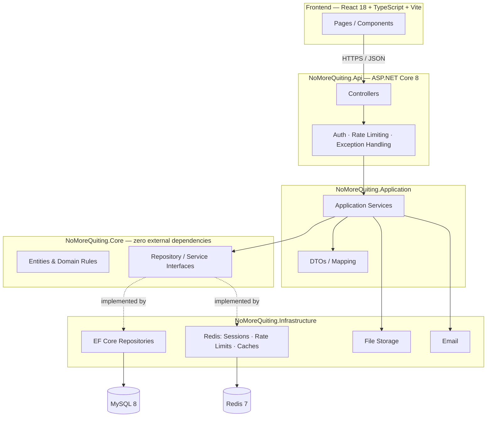
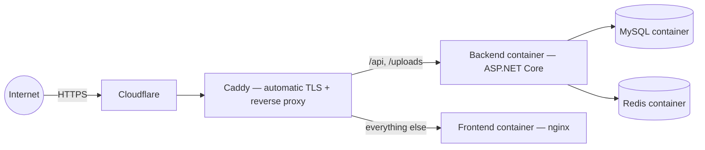

# 🏋️ NoMoreQuiting

**A full-stack workout-tracking platform with gamification, social features, and real operational tooling — built by a team of two.**

**[nomorequiting.com →](https://nomorequiting.com)**

---

## What it is

NoMoreQuiting is a workout-tracking app that goes beyond logging sets and reps. It's built around the idea that **consistency is a behavioral problem, not a logging problem** — so on top of a full training log, it layers gamification (tiered achievements, activity-level ranks, friend/following leaderboards), a real social graph (friends, follows, blocks, public profiles), and two training disciplines (Gym and Fitness) with their own exercise catalogs and scheduling.

It's also a complete production system, not a demo: role-based administration, a support-ticket pipeline with email integration, operational alerting for the person running it, and an audit trail — the kind of surface area a real SaaS product needs.

The source is kept in a private repository; this one exists to describe the system. The app itself is live at **[nomorequiting.com](https://nomorequiting.com)**.

---

## Team & workflow

| | Focus |
|---|---|
| **[Raul&nbsp;Pop](https://github.com/raulpop-codes)** | Backend · Database · Deployment |
| **[Ioan&nbsp;Pop](https://github.com/pop-ioan-30123)** | Backend · Frontend · UI/UX design |

Development is coordinated jointly by both developers, using an **AI-assisted workflow**: features are planned and broken down into tasks, implemented with the help of AI coding tools, and backed by an automated test suite (see [Quality & testing](#quality--testing)).

---

## Feature highlights

### Training
- Custom workout categories per discipline (Gym / Fitness), each with its own color, exercise pool, and recurring schedule
- Live session tracking — sets, reps, weight, per-exercise rest timers — with autosave as you train, not just on finish
- Automatic weight/rep progression suggestions based on your own history
- Personal-record detection and a catalog of 40+ exercises with muscle-group tagging and equipment metadata

### Gamification
- A tiered achievement system (milestones, per-exercise performance tiers, role badges) computed from real training history, with a Redis-backed cache layer so the achievements page doesn't re-walk a user's entire session history on every view
- Activity-level ranks (Bronze → Hall of Fame) driven by trailing training volume
- Friends and Following leaderboards, ranked by the same volume metric, switchable from one toggle

### Social
- Friend requests, following, and blocking, with public profiles that respect per-section visibility settings (friends list, followers, following can each be public / friends-only / private)
- In-app notifications for social activity and support-ticket replies
- A friends/followers/following social graph that's fully IDOR-audited — every query is scoped to the caller, not the requested resource

### Operations & administration
- A founder-only operational alerting system: automated checks for security anomalies (failed-login spikes), support-ticket backlog aging, traffic spikes, and error-rate spikes — with alerts that **escalate in place** (not spam-duplicate) when a condition keeps getting worse
- A full support-ticket pipeline: categorized tickets, file attachments (content-validated, not just extension-checked), inbound email replies via a Cloudflare Worker, auto-close on inactivity, and a founder-only audit log viewer
- Admin tooling for the exercise/muscle-group catalog and account role management, with a feature-backlog board for triaging incoming requests

### Security
- TOTP-based two-factor authentication
- A Redis-backed single-active-session model — a stolen or copied token dies the moment the real owner logs in anywhere else, with graceful fail-open behavior if Redis itself has a hiccup, instead of locking everyone out
- Every session-sensitive account change (password, email, disabling 2FA) invalidates all active sessions immediately
- Rate limiting on every abuse-prone endpoint (login, 2FA verification, password reset, ticket creation/replies/attachments, session refresh) — both per-account and per-IP
- A full internal security audit was run against the codebase mid-project (dead code, N+1 queries, race conditions, and a stored-XSS vector in user-submitted content were all found and fixed) — the kind of pass a real team would budget a sprint for

---

## Architecture

The backend follows **Clean Architecture**: domain logic has zero framework dependencies, and everything else depends inward.

**Why it's built this way:**
- **Core** has no dependency on EF Core, ASP.NET, or Redis — domain invariants (e.g. "a category can't exceed 10 exercises", "a session can't finalize before it starts") live on the entities themselves, testable with zero infrastructure.
- **Application** orchestrates use cases through a `Repository` + `Unit of Work` pattern, so every service talks to abstractions, never to EF Core or StackExchange.Redis directly.
- **Infrastructure** is the only layer that knows about MySQL, Redis, SMTP, or the filesystem — swapping any of them out never touches domain or application code.
- Cross-cutting concerns (rate limiting, session validation, audit logging) are centralized behind single extension points rather than duplicated per service.

### Deployment

Multi-stage Docker builds (SDK → slim ASP.NET runtime for the API; Node → nginx for the static frontend), orchestrated with Docker Compose and running on Oracle Cloud's ARM architecture, with images built for `linux/arm64` and published to a private registry. Caddy handles TLS termination and automatic certificate renewal in front of both containers.

---

## Tech stack

| Layer | Technology |
|---|---|
| **Backend** | .NET 8, ASP.NET Core Web API, Entity Framework Core (Pomelo MySQL provider) |
| **Frontend** | React 18, TypeScript, Vite, React Router |
| **Data** | MySQL 8 (schema managed as plain, reviewable SQL — no black-box migrations) |
| **Caching / Sessions** | Redis 7 (StackExchange.Redis) — sessions, rate limiting, computed-result caching |
| **Auth** | JWT bearer tokens backed by a Redis single-session model, TOTP 2FA |
| **Infra** | Docker, Docker Compose, Caddy (reverse proxy + automatic HTTPS), Cloudflare, Oracle Cloud |
| **Email** | SMTP outbound, Cloudflare Worker for inbound ticket-reply routing |
| **Testing** | xUnit + Moq (backend), Vitest + Testing Library (frontend) |
| **i18n** | Custom English/Romanian dictionaries with compile-time key-parity enforcement via TypeScript |

## Quality & testing

- **750+ automated backend tests** (unit + integration) across the domain, application, and infrastructure layers
- **150+ automated frontend tests** covering component behavior and user flows
- Integration tests run against a real Redis instance for anything cache/session-related — no mocking away the parts that are actually hard to get right
- A dedicated internal audit pass covering dead code, N+1 query patterns, race conditions, and security hardening — documented, triaged by severity, and resolved

---

**[Visit the live app →](https://nomorequiting.com)**

